# VEXEL Architecture Diagrams

This document contains visual diagrams to help understand the VEXEL architecture.

---

## Package Structure Diagram

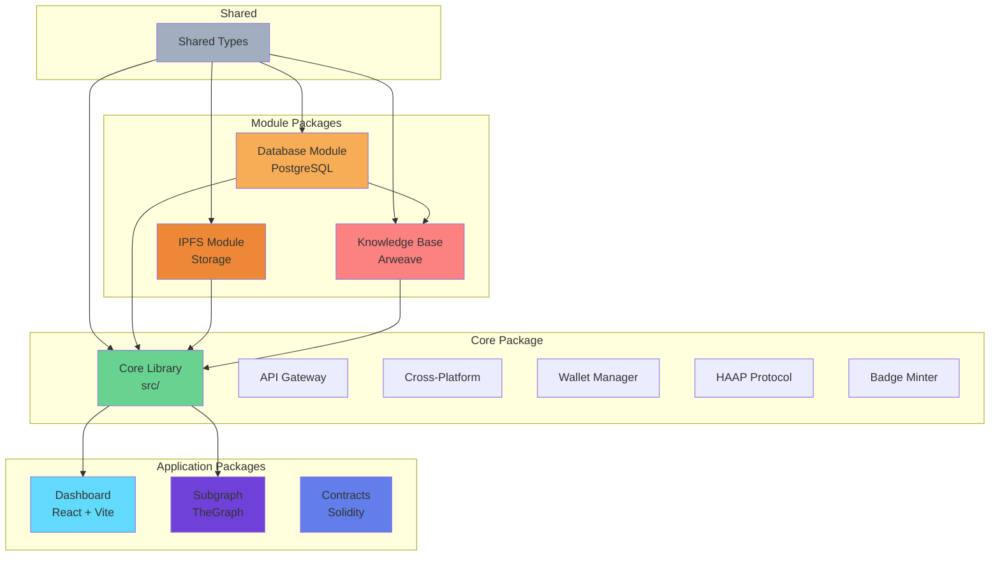

---

## Architecture Layers Diagram

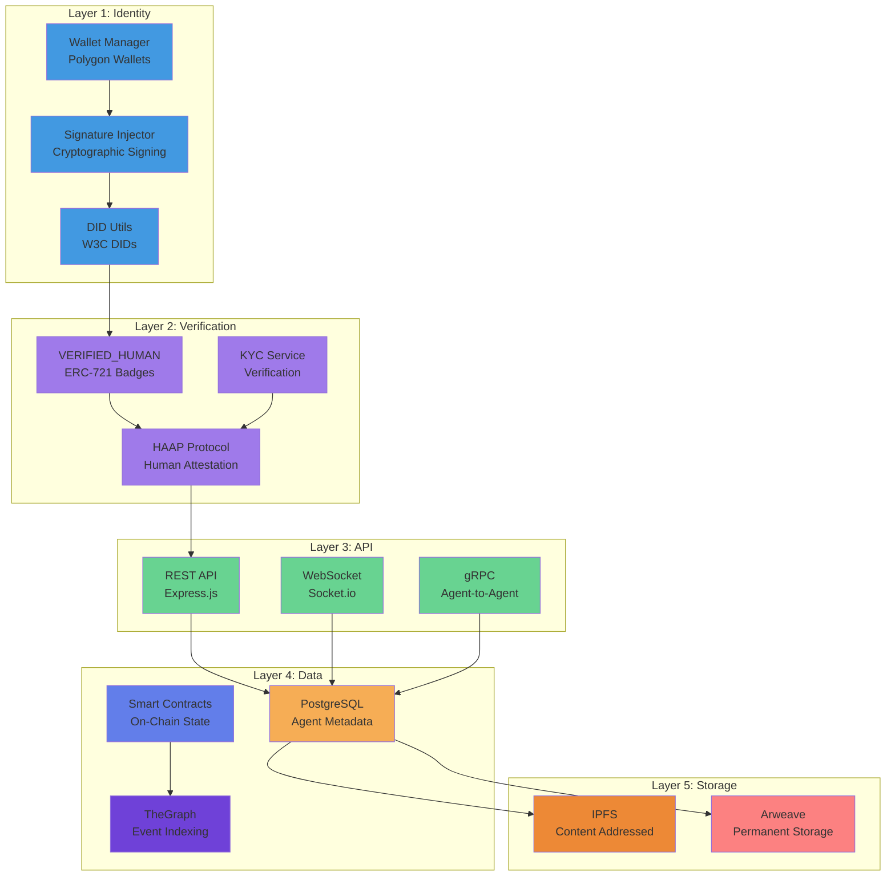

---

## Data Flow: Agent Registration

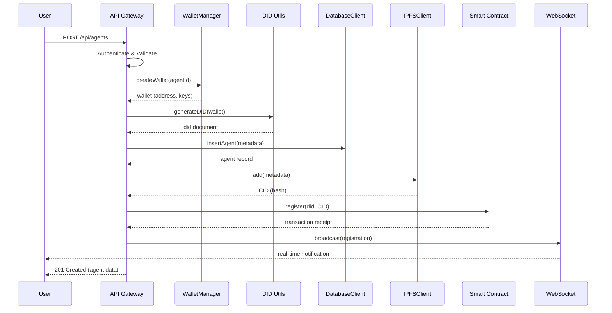

---

## Data Flow: HAAP Protocol

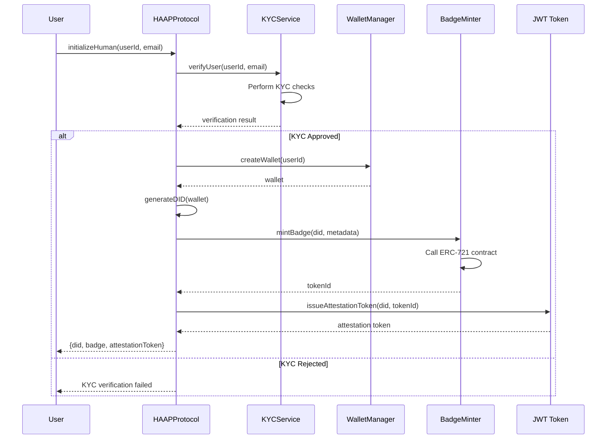

---

## Module Build Dependency Graph

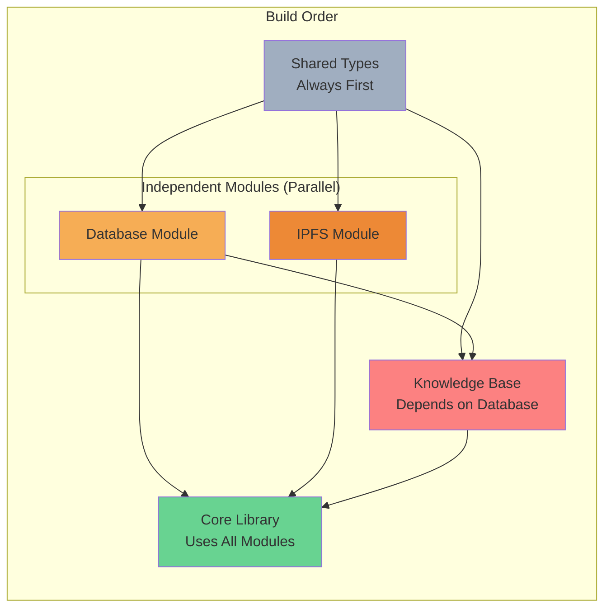

---

## Package Decision Tree

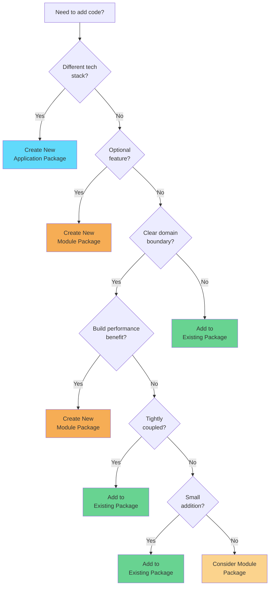

---

## Testing Strategy

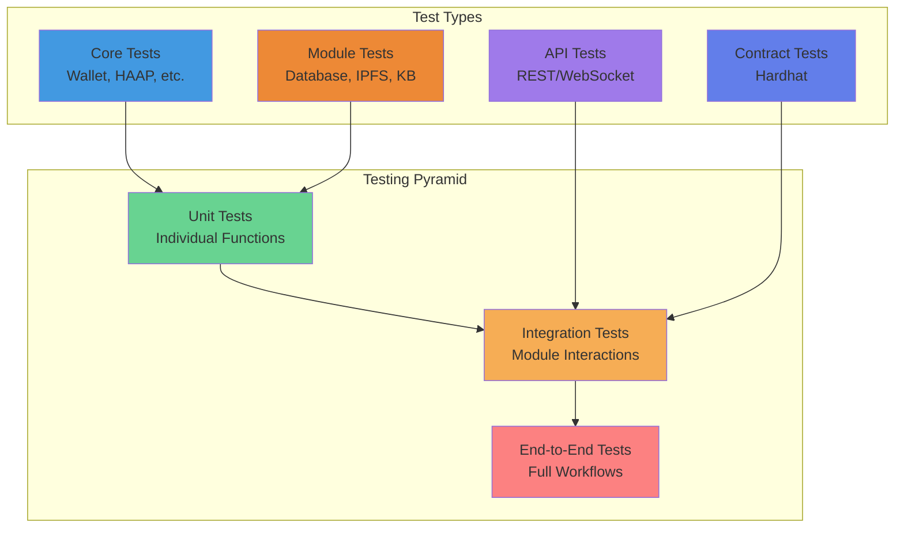

---

## Development Workflow

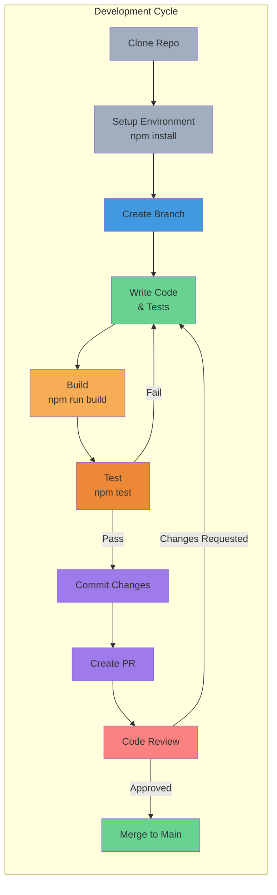

---

## CI/CD Pipeline

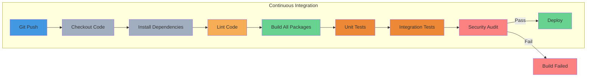

---

## Module Communication Patterns

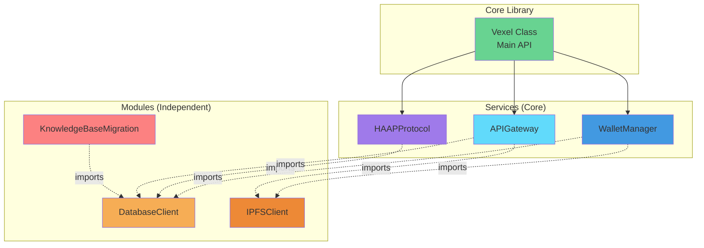

---

## Security Architecture

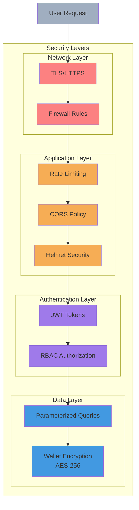

---

## Usage Instructions

### Rendering Mermaid Diagrams

These diagrams use Mermaid syntax and can be rendered:

1. **On GitHub**: GitHub automatically renders Mermaid diagrams in Markdown
2. **VS Code**: Install "Markdown Preview Mermaid Support" extension
3. **Online**: Use [Mermaid Live Editor](https://mermaid.live/)
4. **Documentation sites**: Most static site generators support Mermaid

### Exporting Diagrams

To export as images:

```bash
# Install mermaid-cli
npm install -g @mermaid-js/mermaid-cli

# Export specific diagram
mmdc -i DIAGRAMS.md -o output.png

# Or use online editor and download
```

### Embedding in Documentation

Reference diagrams in other docs:

```markdown
See [Package Structure Diagram](./DIAGRAMS.md#package-structure-diagram)
```

---

## Updating Diagrams

When architecture changes:

1. Update relevant diagram(s) in this file
2. Update corresponding text documentation
3. Test rendering in GitHub preview
4. Commit both code and diagram changes together

---

**Last Updated**: January 2026  
**Maintained By**: VEXEL Contributors  
**Diagram Format**: Mermaid (text-based, version-controlled)
